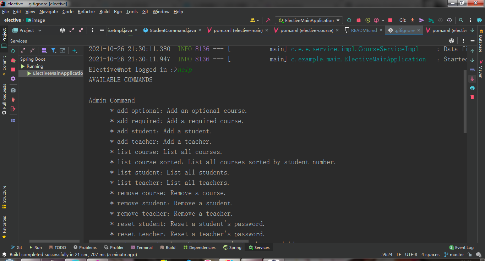
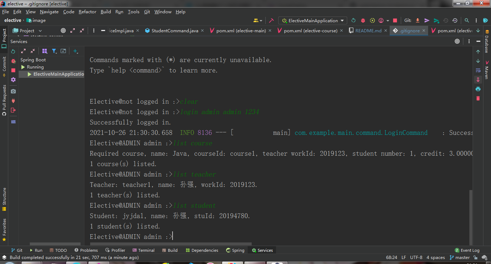
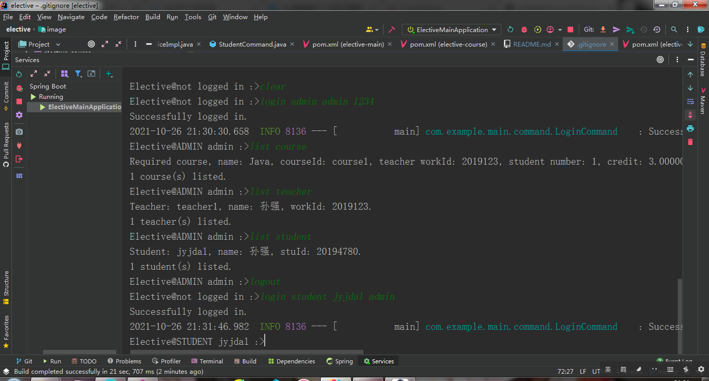
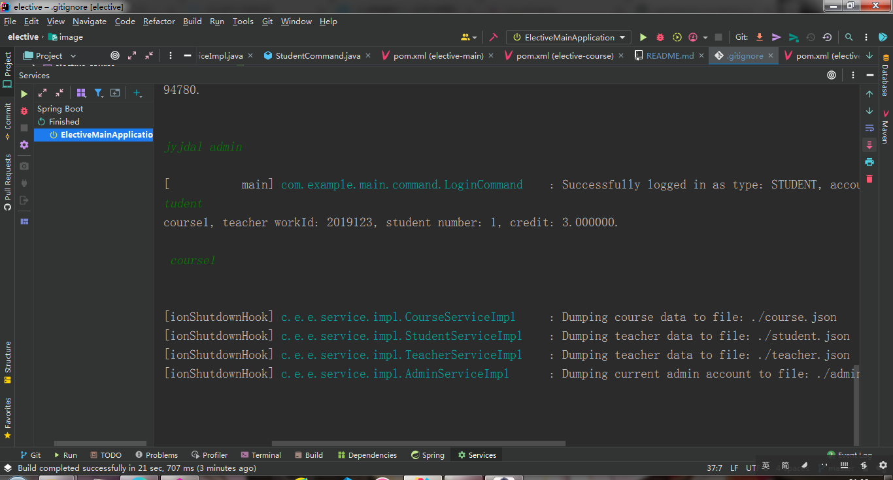

# Elective-Java

一个基于**Java 17**和Spring-Shell的选课系统，《Java程序设计》实验课课后作业

## 项目依赖
* Java 17（一定要是Java 17，因为系统用到了一些只有在Java17才有的API）
* Maven 3.8.1
* spring-boot：系统运行的基本环境
* spring-shell：用于将spring-boot应用转换成命令行应用
* lombok：用于生成getter/setter、全参构造函数、无参构造函数、建造者模式等代码，简化开发流程
* spring-boot-starter-json：使用内置的jackson框架，方便对json数据进行读写
* junit：用于编写测试代码，其中PPT中所列内容全部在com.example.main.exptest包下
* jetbrains-annotation：用于开发时代码的检查，实际运行时用不到

## 基本功能（标*为实验要求外添加的功能）
* 以管理员、教师或者学生的身份登录
* 一套权限认证系统，不同角色只能执行当前角色下的命令
* 管理员能够
  1. 修改登录密码 *
  2. 对课程、老师和学生进行添加或删除
  3. 显示课程、老师和学生列表
  4. 将课程按照选课人数排序
  5. 恢复老师和学生的密码为初始密码123456
* 老师能够
  1. 修改登录密码
  2. 查看自己所授课程
  3. 查看某门所授课程的上课学生列表
* 学生能够
  1. 修改登录密码
  2. 查看自己所上课程
  3. 选修选修课
  4. 退选选修课 *

## 运行
* 源代码运行
源代码下找到**elective-main模块com.example.main包**下ElectiveMainApplication类，执行其中的main方法即可
* 打包成jar包运行
在项目根目录下输入`mvn package`后会生成**elective-main/target/elective-main-0.0.1-SNAPSHOT.jar**
使用`java -jar elective-main-0.0.1-SNAPSHOT.jar`即可运行

## 运行截图

更多命令请在应用内输入`help`以获得更多信息
